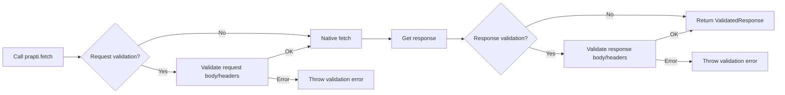

# Prapti

> **प्राप्ति** _(Sanskrit: "to fetch")_ — extends the native `fetch` API with runtime schema validation.

[](https://www.npmjs.com/package/prapti)
[](https://bundlephobia.com/result?p=prapti)
[](#license)
[](https://github.com/kiranojhanp/prapti/issues)

---

## The problem

Every API call has the same boilerplate:

```typescript
const response = await fetch("/api/users");
const data = await response.json(); // typed as `any`
const validated = UserSchema.parse(data); // manual, every time
```

Prapti moves the validation inside `fetch` so you don't have to think about it:

```typescript
const { fetch } = prapti(zodAdapter);
const response = await fetch("/api/users", {
  validate: { response: { body: UserSchema } },
});
const data = await response.json(); // typed, validated, done
```

Same `fetch` API. No new concepts. Add it only to the calls that need it.

---

## Table of contents

- [How it works](#how-it-works)
- [Installation](#installation)
- [Quick start](#quick-start)
- [Usage](#usage)
  - [GET with response validation](#get-with-response-validation)
  - [POST with request and response validation](#post-with-request-and-response-validation)
  - [Header validation](#header-validation)
  - [Custom serialization](#custom-serialization)
- [Adapters](#adapters)
- [API reference](#api-reference)
- [Error handling](#error-handling)
- [License](#license)

---

## How it works



---

## Installation

```bash
npm install prapti zod
```

---

## Quick start

```typescript
import { prapti } from "prapti";
import { zodAdapter } from "prapti/adapters/zod";
import { z } from "zod";

const UserSchema = z.object({
  id: z.number(),
  name: z.string(),
  email: z.string().email(),
});

const { fetch } = prapti(zodAdapter);

const response = await fetch("/api/users/1", {
  validate: { response: { body: UserSchema } },
});

const user = await response.json();
// Type: { id: number; name: string; email: string }
```

---

## Usage

### GET with response validation

```typescript
const response = await fetch("/api/users/1", {
  validate: {
    response: { body: UserSchema },
  },
});

const user = await response.json(); // fully typed
```

### POST with request and response validation

```typescript
const CreateUserSchema = UserSchema.omit({ id: true });

const response = await fetch("/api/users", {
  method: "POST",
  body: { name: "John", email: "john@example.com" },
  validate: {
    request: { body: CreateUserSchema },
    response: { body: UserSchema },
  },
});

const newUser = await response.json();
```

### Header validation

```typescript
const RequestHeadersSchema = z.object({
  authorization: z.string().startsWith("Bearer "),
  "content-type": z.literal("application/json"),
});

const ResponseHeadersSchema = z.object({
  "content-type": z.string().includes("json"),
  "x-rate-limit-remaining": z.string().transform(Number).pipe(z.number()),
});

const response = await fetch("/api/users", {
  headers: {
    Authorization: "Bearer token123",
    "Content-Type": "application/json",
  },
  validate: {
    request: { headers: RequestHeadersSchema },
    response: { headers: ResponseHeadersSchema },
  },
});

const headers = response.validatedHeaders;
console.log(`Rate limit remaining: ${headers["x-rate-limit-remaining"]}`);
```

A few things worth knowing about header validation:

- By default, Prapti preserves your original headers and overwrites them with validated values (`"preserve"` mode). Use `headerValidationMode: "strict"` to send _only_ the validated headers.
- Headers validated to `null` or `undefined` are dropped from the outgoing request.
- Prapti throws if a value in `RequestInit.headers` is `null` or `undefined`, matching native `Headers` behaviour.

### Custom serialization

By default, Prapti uses `JSON.stringify` and `JSON.parse`. You can swap these out per instance:

```typescript
import superjson from "superjson";

const { fetch } = prapti(zodAdapter, {
  serializer: {
    stringify: (value) => superjson.stringify(value),
    parse: (value) => superjson.parse(value),
    isJsonContentType: (contentType) =>
      contentType?.toLowerCase().includes("application/json") ?? false,
  },
});
```

`ValidatedResponse.json()` uses the same serializer for response parsing.

For FormData, non-string values are stringified by default (matching native behaviour). Set `formDataValueMode: "strict"` to throw on `null`, `undefined`, or complex objects instead.

---

## Adapters

Import only the adapter you use — unused adapters are tree-shaken from your bundle.

```typescript
import { zodAdapter } from "prapti/adapters/zod";
import { yupAdapter } from "prapti/adapters/yup";
import { valibotAdapter } from "prapti/adapters/valibot";
```

To use a different validation library, implement `ValidationAdapter`:

```typescript
import type { ValidationAdapter } from "prapti";

const customAdapter: ValidationAdapter<MySchema> = {
  parse: (schema, data) => schema.validate(data),
};

const { fetch } = prapti(customAdapter);
```

---

## API reference

### `prapti(adapter, config?)`

Returns an enhanced `fetch` bound to the provided adapter.

```typescript
const { fetch } = prapti(zodAdapter, {
  serializer: {
    stringify: JSON.stringify,
    parse: JSON.parse,
  },
  headerValidationMode: "preserve", // "preserve" | "strict"
});
```

### `PraptiOptions`

All native `RequestInit` options, plus an optional `validate` block:

```typescript
validate?: {
  request?:  { body?: Schema; headers?: Schema };
  response?: { body?: Schema; headers?: Schema };
}
```

| Field                       | Description                            |
| --------------------------- | -------------------------------------- |
| `validate.request.body`     | Validate the outgoing request body     |
| `validate.request.headers`  | Validate the outgoing request headers  |
| `validate.response.body`    | Validate the incoming response body    |
| `validate.response.headers` | Validate the incoming response headers |

### `ValidatedResponse`

Extends the native `Response` with:

| Method / property  | Description                                      |
| ------------------ | ------------------------------------------------ |
| `json()`           | Parse and validate the JSON response body        |
| `text()`           | Parse response as plain text (no validation)     |
| `blob()`           | Get response as a Blob (no validation)           |
| `arrayBuffer()`    | Get response as an ArrayBuffer (no validation)   |
| `formData()`       | Parse and validate form data                     |
| `validatedHeaders` | Validated response headers as a typed object     |
| `rawHeaders()`     | All response headers as a lowercase-keyed object |

---

## Error handling

Prapti throws two kinds of errors: validation errors from your schema library, and network errors from the underlying `fetch`.

```typescript
try {
  const response = await fetch("/api/users", {
    validate: { response: { body: UserSchema } },
  });
  const users = await response.json();
} catch (error) {
  if (error instanceof ZodError) {
    // API response didn't match UserSchema
  } else {
    // Network or fetch error
  }
}
```

---

## License

Released under the [MIT License](/LICENSE) by [@kiranojhanp](https://github.com/kiranojhanp/prapti).

---

<div align="center">Made with ❤️ from 🇳🇵</div>
